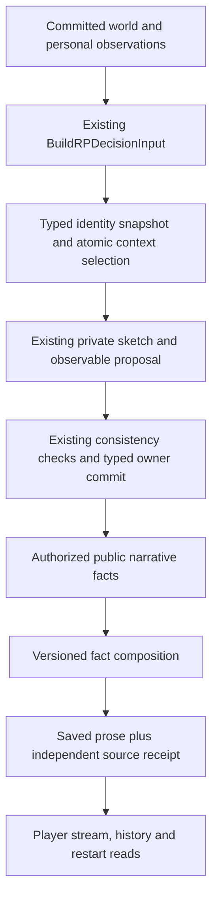

# Existing RP feature accuracy — 2026-10-01

The ledger, typed owners, committed world state and recovery paths already exist. This increment fixes three demonstrated errors in the RP data flow above them. It does not establish a passed R1 or a new long-dialogue experience. Base: `739a3ad94f34dd1d7a0a4cf1ec450ea02514415e`; branch: `rp-preview-integration-20260929`. No preview deployment or real RP-provider call was made.

## Why valid execution was still inaccurate

| Existing promise | Demonstrated failure | Correction and observable acceptance |
| --- | --- | --- |
| Heard words and sources stay exact in the model's view | Substring identity masking changed an excerpt and an Event ID containing an unfamiliar person's ID. | Project exact typed person references only. Preserve all speech/excerpt/private text and provenance bytes; source head, familiarity and aliases share one short snapshot. Actual provider view has policy `corerp.rp-identity-view.v2`. |
| A nearby exchange retains its question and qualification | One recent reply suppressed retrieval of its older question. The first repair still failed on paraphrases/common terms. | Restore complete authorized split-recent groups before lexical ranking. Context selection v2 carries `RecentContext`, budgets the exchange atomically and reports whole-group omission rather than offering just the reply. |
| Exact quoted speech preserves the committed scene | The old prose validator accepted swapped speakers and collapsed separate events with identical words. | A closed fact-composition plan refers to entire fact atoms. Server-owned actor/action/target/utterance framing prevents model-written attribution or event substitution. Each fact appears once in source order. |

These were local counterexamples against the inspected implementation, not newly captured live Rongqing failures. The five [audit reports](audits/2026-10-01-tasks.json) separate initial static findings from later executed reproductions and repairs. Four workers implemented disjoint paths; the fifth independently reviewed the changes, with the parent owning core contracts and HTTP integration. All task creation omitted the model argument, inheriting the current model by tool contract.

The independent review also caught and led to fixes for loss of a refusal marker, discarded supported density framing, receipt groups validated against themselves, and budget selection splitting a restored exchange. Final review restored limited-capability disclosure on settled/replayed turn responses; parent HTTP integration aligned fresh and saved paragraph source fields. These corrections are included, rather than dismissed as old test-fixture incompatibility.

## State flow and contracts

The canonical context keeps sourced persona, directional relationships/address, readiness, knowledge, witnessed dialogue and branch head. The provider presentation is an observer-relative projection, not another world or a second Context Builder. Its snapshot ends before provider invocation; the existing final head/hash/owner validation remains authoritative.

The decision contract remains the already implemented closed v3 `private` plus one typed `observable` proposal. This increment does not add a goal system or broaden action authority. Earlier private sketches remain actor-private historical data, bounded to three; they are not current unresolved-goal state. Cited source membership proves authorized provenance, not semantic entailment or the truth of a spoken claim.

Private decision state and unobserved knowledge still do not enter narration. Speech, expression, movement and activities enter the public narrative input only through the existing commit and observation paths. The narrator cannot publish a proposal merely by referring to it. Canon is never inferred from familiar names or model prior.

## Narrator capability and compatibility

Fresh requests use `corerp.fact-composition.v1`: ordered `fact_ref` atoms, `plain`/`compact`/`contextual`/speech-only `dialogue` templates, and inline or multiline groups. The server binds the actor, expression target, action, refusal stance and exact speech. The model cannot supply arbitrary labels, actions, speech, objects, private thoughts or additional prose fields. Invalid plans take the existing deterministic fallback.

Supported presentation includes grouping, POV, tense and sourced place/time/density framing. The same fact-rich input is tested under concise, standard and long framing. Public character cues and custom instructions can influence only supported choices. Free lexical rewriting, character diction and rich literary atmosphere are **not provided** by this version; fresh and saved versioned views disclose that limit. The compatibility provider kind remains `full_prose`, alongside the explicit composition version. This is a material restriction of fresh prose behavior, not evidence that expressive narration or the user's full R1 goal has been achieved.

Saved legacy prose stays readable unchanged, with no stronger guarantee or backfill. Draft migration 077 adds independent ordered fact-only IDs and paragraph groups to canonical/variant receipts. Save checks authoritative input; reload checks ordered unique group coverage against the independent stored sequence. Canonical saved reads also compare rebuilt authorized facts. Style provenance remains separate from actual facts. NDJSON completion, history, selection and turn replay carry optional version/groups; each streamed paragraph cites its own sources. Unknown/duplicate/reordered receipt groups are rejected after restart in six corruption cases.

077 is unpublished new schema in this increment. A local disposable database that already applied its earlier draft needs explicit correction/recreation before using the revised draft; it cannot automatically reapply that version. Populated pre-077 upgrade and legacy selected-prose readability are tested. No existing world database was replaced or rewritten.

## Hard rules and soft signals

Hard checks cover typed legality/owner/head, visibility, authorized reference membership, source closure where defined, readiness, exact supported attribution, composition syntax/coverage/order/template compatibility, and independent receipt agreement. They do not prove that every natural-language claim follows from a source.

Reply relevance, repetition, personality drift, literary quality and fun remain diagnostics or human judgments. The existing semantic-repetition diagnostic is not turned back into a blocking rewrite. An NPC's statement or promise remains a statement or promise; it does not automatically create an object, completed action or true shared-world claim.

## Executed verification

All checks used the repository Go installation, the existing shared cache and local fixtures. Real RP-provider HTTP calls: **0**. Parent integration results on the final code:

| Check | Result |
| --- | --- |
| Full core, decision and narrative packages | PASS: 0.115s / 0.596s / 1.591s |
| Storage affected identity/context/retrieval/composition/render/budget/legacy/canonical-provider paths | PASS: 25.938s |
| HTTP fresh/cached stream text, source groups/disclosure/no extra model call and explicit/default reasoning controls | PASS: 1.123s |
| Embedded migration byte-parity contracts | PASS: 0.022s |
| Vet of the five affected packages | PASS |

Worker receipt checks additionally passed all durable-stage recovery cases (15.763s combined bounded run, then 12.970s for final replay-warning/saved-source corrections). Vet of storage/HTTP was repeated after those small final corrections and passed. Dedicated schema inventory covers 48 reachable context types, 20 person-reference fields and 94 unrelated ID fields. Worker reports retain the failed old-behavior reproductions, the first incomplete fixes and resource failures. `/dev/shm` capacity caused compile/link errors; retrieval fixture storage failures under that pressure were suspected resource failures, not a decoded SQLite diagnosis. Moving only temporary build/test paths to `/tmp` with the existing cache resolved the checks. No assertions or world constraints were weakened and no shared evidence/cache was deleted.

Exact commands, final source fingerprints and contract/fixture checks are in [the verification record](architecture-accuracy-verification-2026-10-01.json). No current full backend suite, real provider compatibility run, original 32-round suite or frozen Golden replay was performed for this increment.

## R1 exits remain open

The frozen source-world baseline has 11 named roles, including one player and ten NPCs. Those NPCs lack authored personas and there are no authored relationship/address declarations. This is missing creator canon, not proof that supplied canon failed to load. The latest historical frozen replay recorded 17 NOT READY decisions and zero NPC-provider calls. All four original baseline/sample artifacts remain unchanged.

The most recent historical original technical run failed at round 29 on an NPC deadline and did not reach remaining/postchecks. This increment neither changes that result nor declares current world integrity passed. No new comparable Rongqing before/after or human literary acceptance exists. Local contract passes prove corrected data flow only.

Read-only live process verification on 2026-10-01: PID `722907`, binary `/home/ubuntu/.local/share/corerp-preview/corerp-server`, SHA-256 `fea2067aa393dd6608b5502f13a7ee3884d5ba5336203d167de315a99a4cbc23`. It is still the previously recorded backend binary; this source increment was not deployed. The served frontend version was not verified here. GitHub source, a tested checkout and a running preview are different evidence.

Remaining risks: older retrieval is lexical and bounded; upstream window/rune exclusions do not have complete omission diagnostics; SQL group counting scales with authorized history and was not performance-benchmarked; private sketches have no generalized intent lifecycle; natural-language knowledge/relationship entailment is not universally machine-verifiable; actual provider compatibility and deployed source identity remain unverified for this increment; narrative expressiveness remains limited. Existing checked-in short samples retain illness presupposition/repetition risks rather than being silently rewritten.

Next smallest experience step: use an explicitly authored, ready fixture to compare the actual authorized context and public outputs on a fixed short exchange involving a relationship/address, a split question/qualification and a refusal/expression that can be referenced next turn. Keep real canon approval distinct from test authorship. Decide and implement a source-safe expressive presentation contract, then review actual prose. Run the unchanged 32-round and comparable frozen Golden/human exits when those paths and provider conditions are ready. R1 is **NOT DONE**; no R2/R3 work is included.
