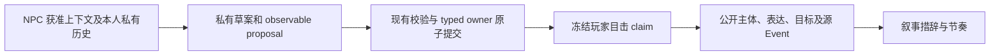

# 可观察事实契约修复 · 2026-09-30

需要继续升级 RP 运行层的上下文选择、意图延续和决策编排。本次先修复了可复现的公开事实契约缺口；没有新增世界状态、owner 或独立 Prompt 链。R1 尚未通过两个验收出口。

## 结构性失败与修复

隔离复制旧叙事包后，三个反例确认：只有“宝钗点头”的事实，也能被写成“宝钗向你点头”或“宝钗向袭人点头”。另四个反例确认：NPC 的等待姿态能许可“转眼过了三天”；抵达能许可离场，离场能许可抵达或坐下。反例、旧源码 hash 和执行结果保存在 [互动对象诊断](expression-target-diagnostic-2026-09-30.json)、[动作类型诊断](observable-type-diagnostic-2026-09-30.json)。这些是可观察授权失败，与文学质量评分无关。

现有 `RPNarrativeFact` 增加可选的公开目标 ID/称呼。目标只从玩家的冻结 `nonverbal_action` 目击 claim 读取，不能从 NPC private、原始 proposal 或未获准看到的 Event target 补入。同轮投影进一步匹配观察者、行为主体、claim key 和 claim type；跨轮投影继续要求冻结目击、场所/序列窗口和既有目标范围。未知目标沿用稳定匿名身份；不能因演员本身匿名而跳过目标遮罩。

Expressive Narrator 收到公开 target 称呼，受控角色按 POV 渲染为“你/我”。默认 Narrator 同样呈现已获准的目标。没有 target 的点头仍可以自然叙述为点头，不能自动补成向玩家点头。已有 beckon 提交链提供真正的玩家目标；没有扩展 NPC 的表达词表或新增目标选择机制。

叙事 guard 的明确 recipient 必须匹配同一个主体、同一种 expression、同一项已提交观察的 target。不能向另一名 NPC 改写，不能从另一种手势借用目标；多人场景中歧义代词和同名对象不获得授权。定向表达的修复反馈和日志类别独立，但不增加修复次数。

玩家与 NPC 移动叙述共用动作类型/场所检查：抵达和离场分别授权相应方向；不能借一次移动添加姿态、目的地或复合互动。`wait` 是角色选择等待，不是时钟推进；当前公开事实投影没有可引用的 elapsed-duration claim，因此明确的“过了 N 分钟/天”不会因存在 wait 而放行。绝对时间仍来自已提交事实的 timestamp；这次没有建立时间推进机制。

## 不变的权限边界

private 意图不经过 D/E，不能进入 Narrator。Event、owner、head/input hash、batch、重试和恢复规则保持。旧 Event、已保存原叙事和冻结 Golden 均未重写；新字段为 additive/omitempty。叙事存储仍验证原事实 Event 顺序，不增加共享事实。

hard rule 继续是授权来源、角色可见范围、合法 observable 和实际提交。新增的明确对象/动作错配是可可靠复现的 veto。中文正文检查仍是有界安全网，不是任意自然语言的证明器；尾置对象、复杂省略、隐喻和未覆盖说法仍需要读样检查。重复、格式残片、答非所问、人格与趣味性继续作为软诊断或人工判断。

## 当前验证

最终本增量 runtime SHA：`f9c6769f81ec5198295c74af008bc728d05983a06090ca5291ed4518549118cb`。

| 检查 | 结果和适用范围 |
| --- | --- |
| 新增反例修复前 | 互动对象、方向/姿态/新目的地及 wait 时间错误可复现；合法源动作也作为正例保留 |
| core/narrative 全包 | PASS；包含对象匹配、原话保真、目标进实际模型请求、错误对象修复和默认 renderer POV |
| storage 定向 | PASS；同轮与下一轮 target、原子动作、私有边界、重建/重启和冻结目标隐私 |
| 相关五包 vet / runtime build | PASS |
| 本增量完整内部 suite | PASS，exit0，七包全部通过（storage877.383s、HTTP69.733s）；日志`/tmp/corerp-r1-observable-contract-internal-20260930.log`，hash和源码记录见[验证结果](observable-contract-verification-2026-09-30.json) |
| 增量前实际 Step 全 32 | FAIL；runtime `31041504…`，27 个浏览器回合通过，第28轮一次120s决策超时回退；83次成功决策、1次timeout、28次真实Full Prose成功。后置检查未执行。见 [持久回执与公开样本](private-observable-32-result-2026-09-30.json) |
| 增量前最新冻结 Golden | 已完成，runtime `31041504…`，15/17决策成功，2次timeout，0手势；[辅助读样](private-observable-golden-review-2026-09-30.md)保留失败 |
| 最终源码冻结 Golden | 已完成，runtime `f9c6769f…`；17/17决策成功，G8真Full Prose首试成功，0手势，仍有盘问/拒斥/杂字和稀疏叙事；见[读样及可比性](observable-contract-golden-review-2026-09-30.md) |
| World Integrity / RP Experience / R1 DONE | 两出口均未完成：实际全32仍未通过；最终Golden采集完成但没有明确体验改善，也没有作者canon/真人复评。R1 NOT DONE |

初始冻结世界、人设/关系空值、必要模型参数和失败样本均保持。其缺失设定不能由原著补入。原 Gemini before/after 是历史配对；Step 的不同运行有随机性，不能把成功率或措辞变化直接归因为某项代码修复。

## 后续架构工作与限制

1. 在同一个 `BuildRPDecisionInput` 内统一当前场景、关系/称呼、近期与相关旧对话、本人私有历史的优先级、去重和总预算；分别保留每个消费者的权限。当前分别受限的几个窗口还没有构成统一选择策略。
2. 在现有激活计划中延续正在交流的对象。未点名时仅靠稳定 ID 或召集多个 NPC，难以维持长对话焦点；不能从别人的私有意图推断对象。
3. 让 NPC observable wire contract 更准确表达动作与附带字段的合法组合。最新 Step 回归日志有 `noop_contains_effects`、截断和最后一次 timeout；目前独立修复机会仍可能消耗120s总预算。不能用增加台词特例、删除世界校验或悄悄清理已提交原话解决。
4. 作者需补充真正采用的人设、关系和称呼，随后按冻结 rubric 由真人评戏。当前私有历史只证明过去意图，不管理目标兑现/失效；词法相关旧对话也不等于语义长期记忆。

本增量没有发布或部署，不代表已获得酒馆式长对话体验。
