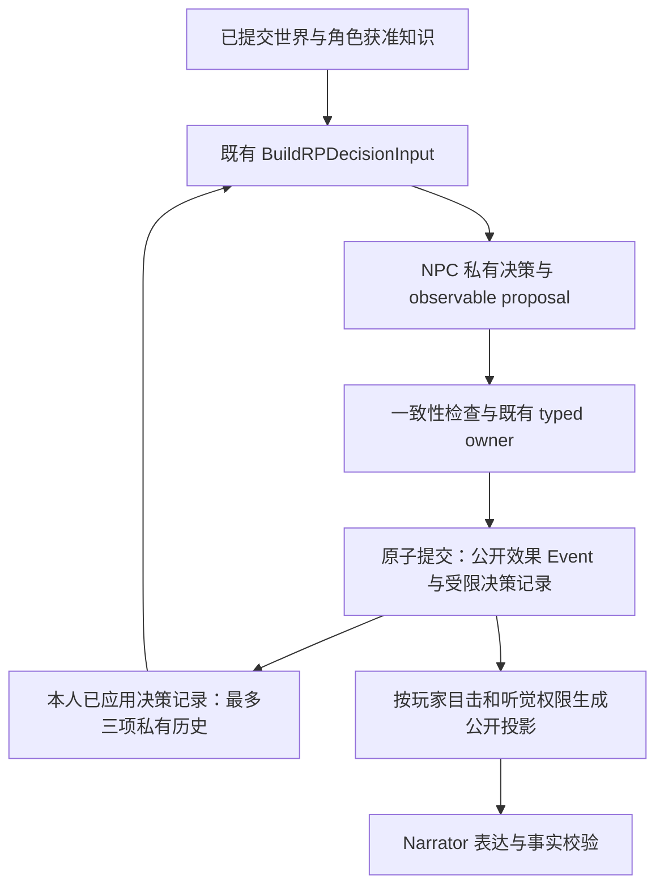

# R1 增量：本人意图延续与可追认动作

本文记录source31041504的历史增量。后续该全32在第28轮timeout后exit1（27浏览器轮通过），对应Golden15/17；本文后续的running状态均为当时快照。最新最终sourcef9c6769f全后端PASS、Golden17/17但体验NOT PASSED，见[可观察契约修复与最终验证](observable-contract-repair-2026-09-30.md)。当前没有运行中的验证任务。

状态：已实现，关键定向测试和完整后端套件PASS；本增量Step32仍在运行，冻结Golden随后采集。R1仍未达到两个验收出口。此前二进制`03205ddc…`的suite/Step第九轮FAIL/Golden属于增量前历史。当前运行时SHA为`31041504fb84c49571cb62fde5cab31fdbfddf12c2e44b9839f9b49f2a266900`。

## 从失败样本发现的结构问题

冻结真实世界缺少人设、关系、称呼和公开表现线索，仍是“贾母不认识宝玉”的首要输入问题。不能从原著补 canon。最新 Step 样本还暴露 NPC 台词中的结构化输出残片和持续动机不足，Narrator 不能静默改写已提交台词来掩盖这些问题。

代码检查确认三个运行路径问题：`private` 已产生和保存，但下一次决策没有读取本人先前意图；主动回合把 `proposal.private` 复制进 Event payload；主动回合接受了 expression proposal，却未提交对应的非语言 Event。修复 expression 后又通过定向反例确认，跨轮叙事窗口只选对白/活动等，遗漏了主动回合已目睹的手势。

## Context 与 Decision Contract

现有 `BuildRPDecisionInput` 的本人上下文增加 `recent_private_decisions`，不另建 builder。来源是现有不可修改的 `rp_npc_decisions`，最多保留三个已实际应用的本人决策，按先后排序。记录原对话对象、时间、事件序号、decision/source ID，以及简短私有意图、情绪、关系姿态和 grounding。

读取要求同 instance/branch、本人 NPC/事件 actor、实际提交命令和 attempt、完整原子 batch 不超出 head、proposal hash 与获准提案相同。审计候选、回滚、当前轮候选、其他角色/分支/世界和不完整 batch head 均不进入历史。重建及重启不依赖新的私有缓存或投影。

它说明“我先前为什么这样回应”，不说明目标仍有效、已完成或已取消，也不能成为人设或公开事实。当前 canon、readiness、可观察状态与本人行动优先。整个 Context 的统一总预算与未完成目标生命周期尚未实现，不能称作完整长期记忆。

Event仅包含可追认效果；私有历史来自同次获准提交的受限记录。图中的两种记录不是两套世界状态，Narrator没有从私有历史读取的通道。

## Observable 与私有边界

普通回应和主动回合复用 `prepareRPNPCExpression` / `commitRPNPCExpression`。获准的支持词表内表情/手势与主决策在同一原子 batch 提交；手势有主决策 causation ID，主动手势另带源 wait ID，使等待结算、重放和重试能覆盖完整 batch。次数预算和热门 NPC 排序只计算主决策，避免把一个对白加手势算成两次主动决策。

主动 Event 只保存 observable proposal，删除其中的 private；完整私有提案继续保存在受限决策记录。没有重写历史不可变 Event。发现的是 Event payload 的私有边界违规；此前公开 outbox 已筛选内容，没有据此声称实际网页泄密。旧 Event 可能仍含旧私有片段，禁止改账本来消除历史记录；公开投影继续必须过滤。

跨轮 Narrator 只选择有玩家冻结目击记录的支持 NPC expression。场所仍需匹配当前发言；有目标的手势要求目击 claim 中目标确为受控玩家。不能把对第三人的招手改写为对玩家的招手，也不能把更宽的玩家 nonverbal 词表自动归为 NPC expression。后来可见不能追授先前目击权限。

Narrator 仍只渲染玩家获准观察的已提交事实；私有意图不进其输入。措辞、节奏、焦点和基于公开人物/场景线索的表现能力保持已有范围；本增量增加的是可用的真实手势来源，没有授权补动作、物品、人物、位置、玩家心理或改写台词。

## Consistency Gate 与提供方

hard rule 沿用 owner/合法动作、head/input hash、来源引用、完整原子提交、目击/身份权限和叙事事实约束。新增私有历史的 hash/owner/head 校验也为硬约束。

格式残片和重复对白共用原有一次 soft-quality 重新提案机会。只提示可能存在的过量 ASCII 闭合结构，不删改对白；合法字面代码/玩家请求的标点不作机器硬拒绝。第二个合法提案仍可提交，不能把“不好听”伪装成必然错误。长输出和非法提案的既有修复预算、120 秒总上限均保持。

六次最小 Step 中转实测中，两种预算字段都在强制长回答下于 64 completion tokens 返回 `length`。官文只列 `max_tokens` 并不能证明中转忽略 `max_completion_tokens`，因此没有修改参数名。[安全探针记录](step-token-parameter-probe-2026-09-30.json)保留原结果。usage 内 `reasoning_tokens=0` 与非空 reasoning content 不一致，不能据此断言思考已关闭或真实 RP 延迟问题已经解决。

## 验证记录

- 修复前，私有主动决策 Event 测试在 respond/silence 两项均失败；修复后两项通过，并验证受限记录、重建、重启和下一次本人读取。
- 修复前，主动 beckon 测试找不到 `RPNonverbalAction`；接入提交后，又发现下一轮 Narrator 没有该手势；修复窗口后通过完整链路。
- 当前关键测试覆盖 rollback、完整 batch head、每日次数一次、wait lineage、源手势解释、不泄私有信息、projection compare/rebuild、重启幂等，以及下一轮玩家引用后 NPC/Narrator 都能读取各自获准内容。
- 隐藏 NPC 的 frown 未被玩家目睹；NPC 后来进入可见区，同轮/跨轮 Narrator 仍不获得旧表情，重建前后公开输入 hash 相同。负例最初误用“不可见主动角色”及重定义不可变 perception link，后改用合法喊话触发和已支持区域移动；未放松这些现有校验。中间一次测试引用错误 result 字段造成编译失败，修正 fixture 后通过。
- decision/core/narrative/endpointpolicy/outbound 五包测试 PASS；storage 关键新增/私有/表达测试 PASS；五个相关包 vet PASS。一次较广 storage 定向运行的唯一失败为上述已修正 fixture；该次完整源码套件随后通过，记录见下一项。
- 当前完整后端`go test ./internal/... -count=1 -timeout=20m` exit0，七包全部PASS，storage875.446s、HTTP69.948s。日志：`/tmp/corerp-r1-private-observable-internal-20260930.log`；[持久验证记录](private-observable-verification-2026-09-30.json)保留日志hash与实际运行时hash。
- 当前 Step 网页 profile 32 轮日志：`/tmp/corerp-r1-private-observable-32-20260930.log`；使用 low、4096 决策/4096 解析、120 秒，disable-thinking=false，不把 fallback 算为成功。
- 已完成的11个浏览器回合及公开台词另存[运行中快照](private-observable-32-checkpoint-2026-09-30.json)。它包含33次成功NPC决策和11次真实Full Prose成功时的检查点，进程仍在运行，不能标记full32通过。已出现speech_format_residue诊断；当前公开样本仍有无依据的“你没留意”、把背景任务说成已发生动作的言语主张，以及台词尾换行导致独立闭引号等体验问题。NPC的已提交言语是言语证据，不是这些主张已被世界确认；这些质量问题未因机器回归通过而消失。
- 当前代码冻结 Golden 将在技术回归结束后运行；必须另存样本，保留原冻结 before/after 和以前的 Step 诊断。真人 rubric 仍未完成。

## 尚未解决

缺作者 canon 和真人体验判断；没有语义长期记忆、统一 Context 总预算、持续目标完成/失效管理或未点名对话对象延续。格式 soft signal 可能漏报或误报，不能保证残片归零；中文 prose guard 仍是有界安全网。模型真实延迟、跨模型对照可比性和当前完整 32 轮必须用本增量新证据分别报告。没有发布、提交或部署。
